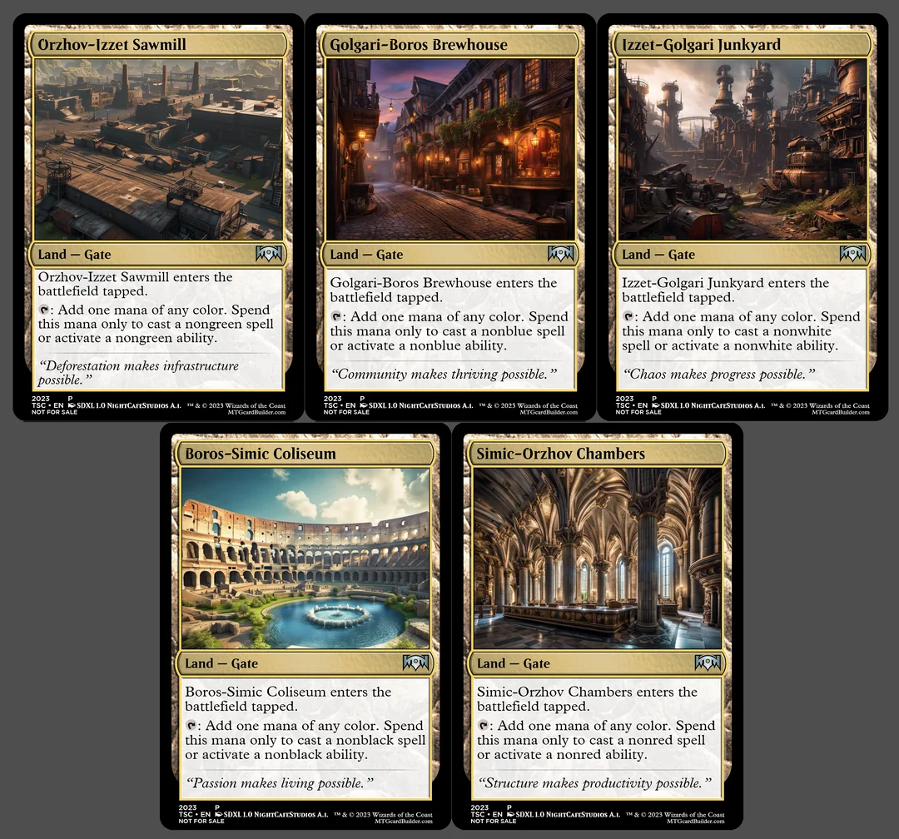

# Pile o’ Magic

Pile o' Magic is my own sort of "formalization" of the Big Deck Magic formula, as I've often been dissatisfied looking for a general consensus on the rules.

## Format Rule Changes

Unless otherwise noted, all normal Magic: The Gathering rules apply.

### The Pile

Players all play out of a shared Library which is generally referred to as the Pile during construction or in format rules.

A pile may be formed in a few manners:

* *Messy Pile*: Players all bring their own set of 45+ cards to shuffle into the Pile.  
* *Themed Pile*: A Pile is constructed in advance (collaboratively or by a host) which adheres to a central theme, MTG Set, mechanical archetype, etc.

### Lands

Generally speaking, lands that only have mana abilities are not included in the Pile. Instead, we have included a classification of *Heap Lands* which is simply a list of Land cards Players will be able to retrieve from outside the game.

Once per turn, during their Upkeep, a player may place a card from their hand in the absolutely-removed-from-the-freaking-game-forever zone. That player then adds a *Heap Land* from outside the game to their hand. The chosen *Heap Land* must be able to produce mana of each color in the removed card’s Color Identity; it must not be able to produce mana of any additional colors.

This mechanic may be streamlined in practice to simply putting the card in a designated “land area” with the understanding that it now represents the specified land. Many players will prefer this over having a separate pile of lands outside the game.

Valid *Heap Lands* are defined below in the *Pile Composition* section.

### Zones

Players share a Library and an absolutely-removed-from-the-freaking-game-forever zone. Other zones (graveyard, exile, etc) are not shared.

This may lead to interesting strategies around milling, recursion, and so on. Such unexpected effects are fine and shouldn’t be concerning unless they begin to lessen the fun for players.

## Pile Composition

### Card Count

For maximum madness, the traditional deck size is \~300 cards. However, *Themed Piles* may benefit from smaller card pools. The minimum Pile size is 45x(number of players).

### Singlesome

Part of the fun of Pile o’ Magic is the element of discovery– and of unique games. In general, you should try to avoid including multiple copies of cards.

Of course, when making a *Messy Pile*\*, you could end up with duplicates even if players avoid bringing them. Additionally, some cards only make sense to include with duplicates (**S.N.O.T.**)

The maximum copies of a single card allowed in the Pile is 4x(number of Players). Except for the exceptions, of course (**Rat Colony**, **Hare Apparent**).

### Heap Lands

The following Land cards are considered valid *Heap Land*s which can be retrieved from outside the game in accordance with the rules.

* Basic Lands: Plains, Island, Swamp, Mountain, Forest, Wastes  
* Dual-Color Lands  
  * Generic: Meandering River, Submerged Boneyard, Cinder Barrens, Timber Gorge, Tranquil Expanse, Forsaken Sanctuary, Foul Orchard, Woodland Stream, Highland Lake, Stone Quarry  
  * Dual-Types: Idyllic Beachfront, Contaminated Aquifer, Geothermal Bog, Wooded Ridgeline, Radiant Grove, Sunlit Marsh, Haunted Mire, Tangled Islet, Molten Tributary, Sacred Peaks  
* Tri-Color Lands: Seaside Citadel, Arcane Sanctum, Crumbling Necropolis, Savage Lands, Jungle Shrine, Nomad Outpost, Frontier Bivouac, Sandsteppe Citadel, Mystic Monastery, Opulent Palace  
* Five-Color Land: Transguild Promenade

Four-Color Lands? Unfortunately, there are no straightforward four-color lands. Feel free to make some up (I like [these Gates](https://www.reddit.com/r/custommagic/comments/15b4j4c/a_cycle_of_fourcolor_lands/) by [Reddit user TerryTags](https://www.reddit.com/user/TerryTags/)). Or maybe allow four color cards to retrieve a Transguild Promenade. Decide together. These cards aren’t very common– it won’t come up much.

### Sleeves

When playing with a *Messy Pile*, should Players avoid sleeving their cards to prevent opponents gaining insight on the content of their hands? Should all Players re-sleeve their cards to one shared color/style?

In short: no. Players should still sleeve their cards (with unique sleeves\!) so that ownership is easy to establish at the end of the game.

Will the sleeves potentially present information to your opponents? Yeah, sometimes. It is a consequence of the format, but not one that often impacts the fun.

## Disallowed Cards

### Tutors

Tutoring is generally against the “play what you find” spirit of Pile o’ Magic. They should be discouraged for the sole reason that t*hey will take an inordinate amount of time to resolve*. (The deck is enormous and players won’t know all the cards if you’ve built a *Messy Pile*\*.)

This isn’t a true “ban” on the card type. Total bans would prevent funny cards like **Booster Tutor** which don’t have the same issues. Just consider carefully before including any tutors– will they truly add to the fun?

Addendum: For cards like **Tempest Hawk** you could consider just having a separate pile of fetchable Tempest Hawks set aside, though no formalized rules or considerations have been made for this concept. Talk to your group.

## Rules Clarifications

### The Absolutely-removed-from-the-freaking-game-forever Zone

Cards in the ARFTFGF Zone are outside “Outside The Game”- they cannot be played by cards like **Wish**. ([https://markrosewater.tumblr.com/post/146325356493/i-get-that-a-card-removed-from-the-game-for](https://markrosewater.tumblr.com/post/146325356493/i-get-that-a-card-removed-from-the-game-for))

Additionally, “Forever” only refers to the duration of the current game. ([https://markrosewater.tumblr.com/post/50514158983/if-a-player-has-his-creature-hit-with-an-awol-can](https://markrosewater.tumblr.com/post/50514158983/if-a-player-has-his-creature-hit-with-an-awol-can))

## Other References

### Four-Color Gates by Reddit User TerryTags

Source: [A cycle of four-color lands](https://www.reddit.com/r/custommagic/comments/15b4j4c/a_cycle_of_fourcolor_lands/) by Reddit user TerryTags.

## Commander Variant

### But I want to play Commander\!

No problem. Life totals are now 40, *Singlesome* becomes *Singleton*, and you’re the proud new owner of a Command Zone. All we need to figure out is who is occupying that zone.

### Let the Pile decide.

The first option we’ll examine is to find a Commander using the Pile. Prior to the game, each Player reveals cards from the top of the Pile until they reveal a Creature. That Creature becomes their Commander and is moved to the Command Zone. You may also limit this to the first *Legendary* Creature they reveal (or whatever restrictions you like).

The Creature revealed may not (likely will not) match the Color Identity of the entire deck, which is usually a requirement when building a Commander deck. For “Pile o’ Magic: Commander” we will ignore this requirement. During play, the Commander otherwise behaves as normal.

### Bring your own.

Option number 2 is to just bring your own Commander\! Each Player brings a 5-color Legendary Creature (separate from any cards being contributed to a *Messy Pile*) which will serve as their Commander.

Try to avoid bringing Commanders with tutor-like effects. They enable Players of *Messy Piles* to focus more on their own card contributions. The Players should be focused on playing into the unpredictable card pool of Pile o’ Magic.

### Deal ‘em.

Now onto Option 3: each Player brings 3 Legendary Creatures which may serve as a Commander (disregard Color Identity). All of these creatures are shuffled together.

Each Player is dealt 3 random Commander candidates, they then choose the Commander they like (or think they can use) best. The remaining Commander candidates can be kept out of the game or shuffled into the Pile.

### What *specific* Commanders are good for this format?

Fear not: I have opinions\!

Tribals don’t work well because unless you’re playing a specific creature-type themed Pile, you won’t reliably be able to use tribal effects.

Commanders which tutor or search for specific categories are going to slow play tremendously and may suffer similar issues as tribals.

Commanders which generically enhance other cards, gain strength themselves, or get value out of mana or spells are going to work nicely. Whatever the Pile provides, you’ll utilize it\!

| Commanders in Pile o’ Magic |  |  |
| :---- | :---- | :---- |
| **Commander** | **Status** | **Why** |
| The Ur-Dragon | Bad | Tribal |
| Jodah, The Unifier | Bad | Search |
| Tiamat | Bad | A *Tribal Search*– oof. |
| Kenrith, the Returned King | Good | Generic “good” effects, value from mana |
| Omnath, Locus of All | Good | Value from mana |
| Ramos, Dragon Engine | Good | Self-empowerment, mana generation |
| Jodah, Archmage Eternal | Good | Generic spell reduction |
